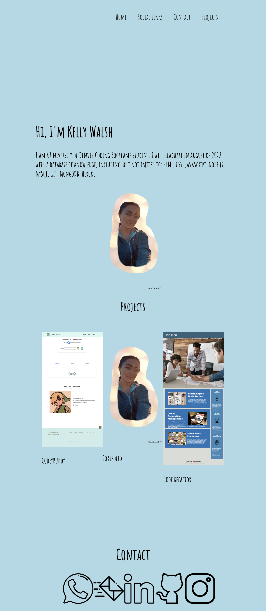

[![Contributors][contributors-shield]][contributors-url]
[![Forks][forks-shield]][forks-url]
[![Issues][issues-shield]][issues-url]
[![MIT License][license-shield]][license-url]
[![Stargazers][stars-shield]][stars-url]
[![GitHub Watchers][github-watchers]][github-watchers-url]

# Kelly Walsh Portfolio

<!-- PROJECT LOGO -->
 

  

<h3 align="center">Kelly Walsh Portfolio</h3>

  

     
    <a href="https://github.com/kemwalsh/kwPortfolio"><strong>Explore the Docs »</strong></a>
     
     
    <a href="https://kemwalsh.github.io/kwPortfolio/">View Demo</a>
    ·
    <a href="https://github.com/kemwalsh/kwPortfolio/issues">Report Bug</a>
    ·
    <a href="https://github.com/kemwalsh/kwPortfolio/issues">Request Feature</a>
  

## Description:

AS AN employer
 
I WANT to view a potential employee's deployed portfolio of work samples
 
SO THAT I can review samples of their work and assess whether they're a good candidate for an open position

## User Story

GIVEN I need to sample a potential employee's previous work
 
WHEN I load their portfolio
 
THEN I am presented with the developer's name, a recent photo or avatar, and links to sections about them, their work, and how to contact them
 
WHEN I click one of the links in the navigation
 
THEN the UI scrolls to the corresponding section
 
WHEN I click on the link to the section about their work
 
THEN the UI scrolls to a section with titled images of the developer's applications
 
WHEN I am presented with the developer's first application
 
THEN that application's image should be larger in size than the others
 
WHEN I click on the images of the applications
 
THEN I am taken to that deployed application
 
WHEN I resize the page or view the site on various screens and devices
 
THEN I am presented with a responsive layout that adapts to my viewport

(<a href="#top">back to top</a>)

## Application Features:

- Gives user information on my skills
- Fits on many screens
- Allows users to contact me

(<a href="#top">back to top</a>)

## Application Appearance and Functionality:

Website's Appearance:

<!-- Add link to gif -->

<!--  -->

### Built With

- [HTML](https://en.wikipedia.org/wiki/HTML)
- [CSS](https://developer.mozilla.org/en-US/docs/Learn/CSS/First_steps/What_is_CSS)

(<a href="#top">back to top</a>)

## Project Links

[Repository](https://github.com/kemwalsh/ckwPortfolio)

[Live Website](https://kemwalsh.github.io/kwPortfolio/)

## Credits

List of Contributors:

1. Kelly Walsh

## Contact Info

Kelly Walsh - kellywalsh827@gmail.com
 
[![LinkedIn][linkedin-shield]][linkedin-url-kelly] [![GitHub][github-shield]][github-url-kelly]  

(<a href="#top">back to top</a>)

<!-- MARKDOWN LINKS & IMAGES -->
<!-- https://www.markdownguide.org/basic-syntax/#reference-style-links -->

[contributors-shield]: https://img.shields.io/github/contributors/kemwalsh/kwPortfolio.svg?style=for-the-badge
[contributors-url]: https://github.com/kemwalsh/kwPortfolio/graphs/contributors
[forks-shield]: https://img.shields.io/github/forks/kemwalsh/kwPortfolio.svg?style=for-the-badge
[forks-url]: https://github.com/kemwalsh/kwPortfolio/network/members
[stars-shield]: https://img.shields.io/github/stars/kemwalsh/kwPortfolio?style=social
[stars-url]: https://github.com/kemwalsh/kwPortfolio/stargazers
[issues-shield]: https://img.shields.io/github/issues/kemwalsh/kwPortfolio.svg?style=for-the-badge
[issues-url]: https://github.com/kemwalsh/kwPortfolio/issues
[license-shield]: https://img.shields.io/github/license/kemwalsh/kwPortfolio?style=for-the-badge
[license-url]: https://github.com/kemwalsh/kwPortfolio/blob/master/LICENSE
[linkedin-shield]: https://img.shields.io/badge/-LinkedIn-black.svg?style=for-the-badge&logo=linkedin&colorB=555
[linkedin-url-kelly]: https://www.linkedin.com/in/kellywalsh001/
[github-shield]: https://img.shields.io/badge/-Github-blueviolet.svg?style=for-the-badge&logo=Github&colorB=555
[github-url-kelly]: https://github.com/kemwalsh
[github-watchers]: https://img.shields.io/github/watchers/kemwalsh/kwPortfolio?style=social
[github-watchers-url]: https://github.com/kemwalsh/kwPortfolio/watchers

# kwPortfolio
